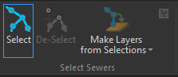
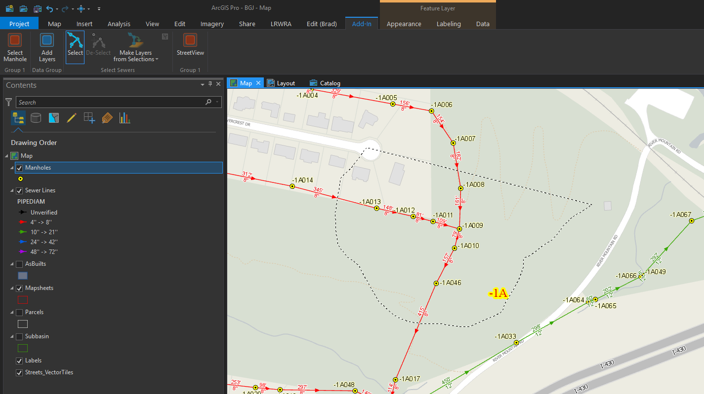
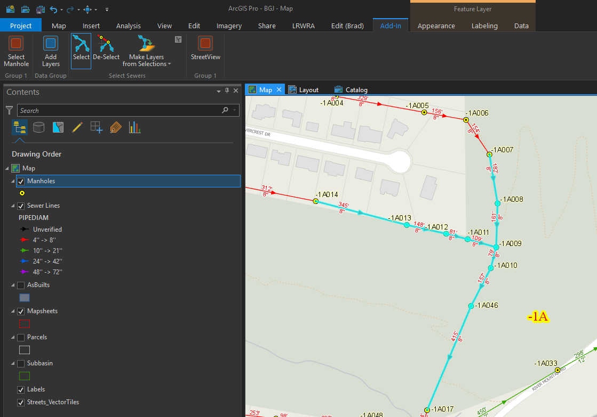
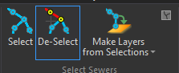
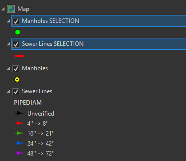

---

---

# **ArcGIS-Pro-SewerSelect**  

An ArcGIS Pro add-in that contains several controls for users to select sewers and manholes then, if needed, create layers from selected features.

This tool is also apart of the larger [LRWRA add-in](https://github.com/dogwoodgeo/ArcGIS-Pro-LRWRA) 

**Note**: I am a novice .Net developer, at best.  The add-in works, but feel free to let me know if you see any code that is "wrong" or just plain bad.  

## Getting Started

Clone or download the repository. Open Visual Studio 2015 or 2017, build solution, launch ArcGIS Pro and check the **Add-Ins** tab.


### Prerequisites

```
Language:				C#
Contributor:			Bradley Jones, bjones@dogwoodgeo.com
Organization:			Little Rock Water Reclamation Authority (LRWRA)
Org Site: 				https://git.lrwu.com/portal
Date:					10/31/2018
ArcGIS Pro:				2.2
ArcGIS Pro SDK: 		2.2
Visual Studio: 			2017, 2015
.NET Target Framework:	4.6.1
```

### How To Use Add-In

**NOTE:** The tools in this add-in will only work on the layers if they are named "Manholes" and "Sewer Lines." 

1. Build add-in (see **Getting Started**)
2. Launch ArcGIS Pro.
3. Go to **Add-In** tab

#### Select

1. Activate tool.  At this point the Sewer Lines and Manholes layers will be set to be the only selectable layers. 

   

2. Using the coded "Lasso" tool, draw around area encompassing the features you wish to select.

   

3. Features will be selected. You can continue to add to selection with the same tool.  No need to Shift +Click.

   


#### De-Select

**NOTE:** This tool will only be activated when there are features (any) selected in the map.

1. Activate tool.  While the Select tool works by drawing a "lasso", the De-Select tool use a point-click to work. This makes it easier to de-select point features like manholes.

   


   2. Click on the feature you wish to de-select.

#### Make Layers from Selections

**NOTE:** This tool will only be activated when there are features (any) selected in the map. Also, selection layers will only be made for layers that are named "Manholes" and "Sewer Lines." 

1. Select layer, or combination of layers, you wish to make from selections.

   


2. Selection layers will be added to map with the symbols and names shown in image below.

   

